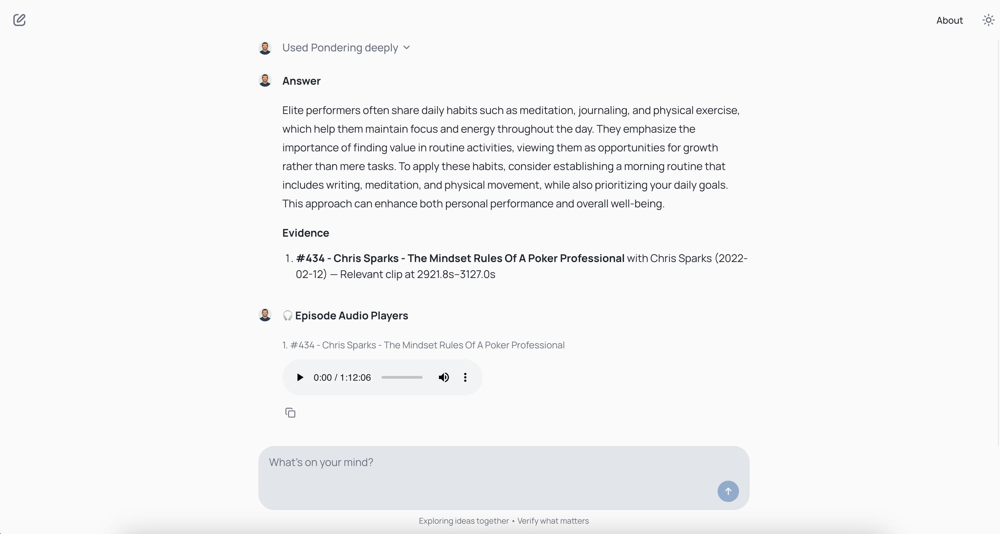
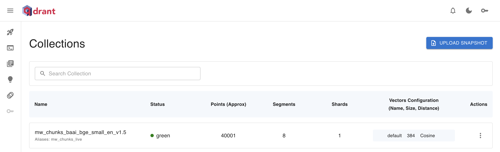
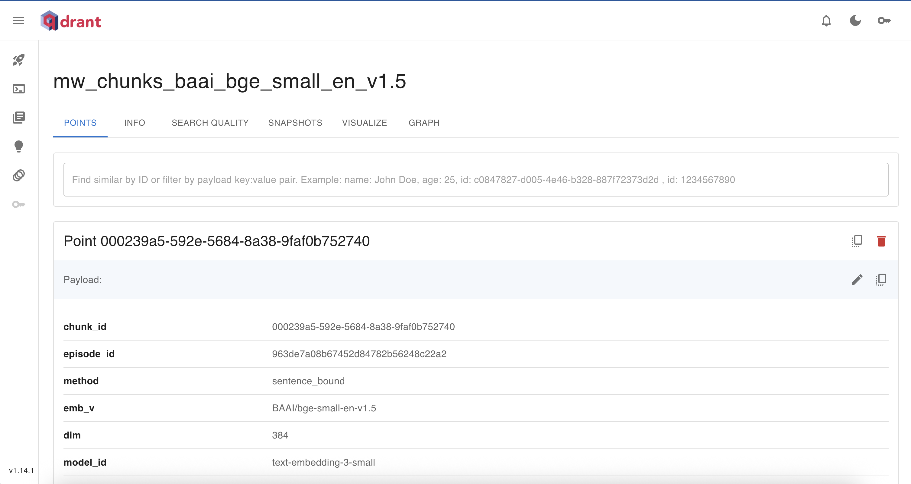
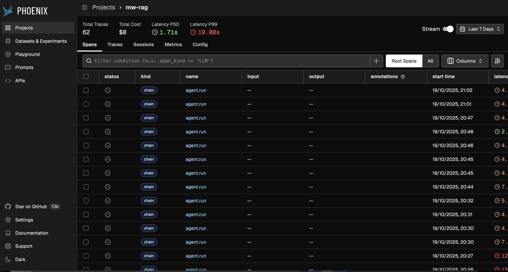
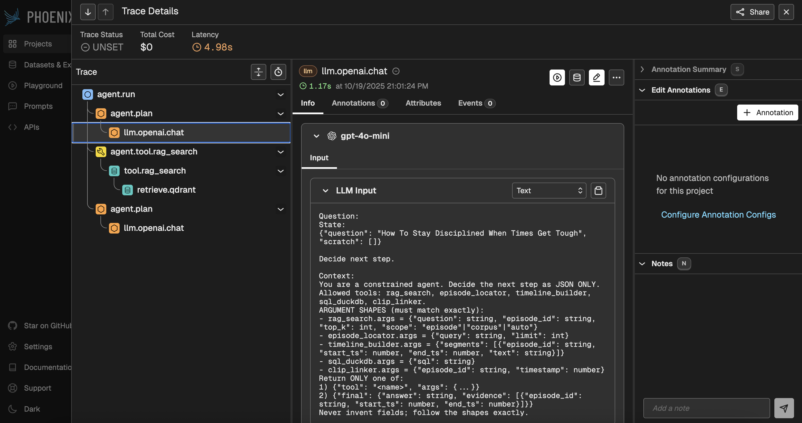

# Modern Wisdom – AI RAG Pipeline

## Motivation and Context

This project applies retrieval-augmented generation (RAG) techniques to *Modern Wisdom*, a long-form podcast hosted by Chris Williamson.
The motivation came from wanting to make multi-hour episodes **searchable, comparable, and summarised** through natural language questions.

Modern Wisdom covers deep topics – philosophy, self-improvement, science, and culture – but most insights are locked inside audio.
The aim was to build an **LLM-native pipeline** that transforms raw audio into a structured, queryable knowledge base.
From ingestion of podcast metadata, through transcription, chunking, embedding, vector storage, retrieval, and evaluation – each spike incrementally builds towards an interactive, explainable RAG system.

The final solution supports:

* **Natural language search** across episodes and years.
* **Comparisons over time** (e.g. a guest's views in 2021 vs 2024).
* **Clip linking** directly to transcript timestamps.
* **Evaluation and monitoring** with Phoenix.
* **Reproducible, containerised deployment**.




---

## Project Overview

| Area                 | Description                                                                                                              |
| -------------------- | ------------------------------------------------------------------------------------------------------------------------ |
| **Dataset**          | Modern Wisdom podcast RSS + audio                                                                                        |
| **Objective**        | Build an end-to-end RAG system: ingestion → transcription → chunking → embedding → vector store → retrieval → agentic QA |
| **Architecture**     | Python + DuckDB + Parquet + Qdrant + FastEmbed + OpenAI (optional)                                                       |
| **Interface**        | FastAPI (programmatic API) and Chainlit 2.8.3 (chat UI)                                                                  |
| **Evaluation**       | Retrieval metrics (Hit@k, MRR, p95 latency), LLM output validation, Phoenix tracing                                      |
| **Containerisation** | Docker Compose (Qdrant, Phoenix, API, Chainlit)                                                                          |
| **Reproducibility**  | `uv.lock` pinned dependencies and documented setup                                                                       |

---

## Repository Structure

```bash
modern-wisdom-llm-native-pipeline/
├── data/
│   ├── duckdb/modern_wisdom.duckdb      # Local DB (episodes, transcripts, chunks, embeddings)
│   ├── transcripts/                     # Parquet ASR output per episode
│   ├── chunks/sentence_bound/           # Chunks ready for embedding
│   ├── embeddings/BAAI_bge_small_en_v1_5/  # Embedding vectors per episode
│   ├── qdrant/                          # Local vector DB storage (Docker volume)
│   ├── qa/labels.csv                    # Ground truth Q/A pairs for evaluation
│   ├── evals/                           # Retrieval and LLM evaluation outputs
│   └── tmp/                             # Temporary lists for backfills
│
├── docs/
│   └── decisions/                       # Design and evaluation decisions per spike
│
├── spikes/
│   ├── spike1_rss_to_duckdb/            # RSS ingestion
│   ├── spike2_asr_timestamps/           # ASR transcription
│   ├── spike3_chunking_and_metadata/    # Chunking experiments
│   ├── spike4_embeddings/               # Embedding generation
│   ├── spike5_qdrant_collection/        # Vector store creation
│   ├── spike6_qdrant_retrieval/         # Retrieval baseline
│   ├── spike7_hybrid_search/            # Hybrid RRF search
│   ├── spike8_rag_contract/             # RAG generation contract
│   ├── spike9_sql_introspection/        # SQL and metadata tools
│   ├── spike10_tracing_monitoring/      # Phoenix tracing
│   └── spike11_agent/                   # Constrained agent with reasoning chain
│
├── src/modern_wisdom_rag_pipeline/
│   ├── api.py                           # FastAPI app for programmatic access
│   ├── chainlit_app.py                  # Chainlit conversational UI
│   ├── agent.py                         # Constrained agent with tool orchestration
│   ├── tools.py                         # RAG search with hybrid reranking
│   ├── tools_constrained.py             # Validated tool wrappers
│   ├── qdrant_ops.py                    # Collection and alias management
│   ├── cli.py                           # Embedding management CLI
│   └── ...                              # Core utilities (paths, tracing, generator, etc.)
│
├── infra/                               # Optional standalone docker-compose files
├── Dockerfile                           # Multi-stage build
├── docker-compose.yml                   # Full local stack (Qdrant, Phoenix, API, Chainlit)
├── pyproject.toml                       # Dependency and build configuration
└── uv.lock                              # Locked dependency versions
```

---

## Summary of Spikes 1–7

Each spike explores one layer of the pipeline. Full details are in the individual README files within each spike folder.

### Spike 1 – RSS to DuckDB

**Purpose:** Incremental ingestion of the Modern Wisdom RSS feed into a structured DuckDB database using dlt.
**Outcome:** 991 episodes loaded, incremental updates confirmed idempotent.
**Rationale:** Local DuckDB offers analytical speed and SQL ergonomics without requiring a remote DB.

### Spike 2 – ASR with timestamps

**Purpose:** Convert audio into timestamped transcripts using AssemblyAI or local Faster-Whisper.
**Outcome:** Complete corpus transcribed to Parquet. Average confidence ≈ 0.92.
**Rationale:** Timestamps enable search, clipping, and alignment with video/audio.

### Spike 3 – Chunking and metadata

**Purpose:** Split transcripts into semantically meaningful windows.
**Methods tested:** fixed-size, sentence-bound, time-window.
**Decision:** *Sentence-bound* performed best (Hit@20 = 0.72, MRR = 0.38) balancing recall and readability.
**Rationale:** Sentence boundaries maintain context and minimise mid-sentence cuts.

### Spike 4 – Embeddings

**Purpose:** Generate vector embeddings from chunks.
**Comparison:**

* OpenAI `t3-small` (1536 d) – accurate, slower.
* FastEmbed `BAAI/bge-small-en-v1.5` (384 d) – fast, open, cost-free.
  **Decision:** FastEmbed chosen for local reproducibility and good recall–latency trade-off.

### Spike 5 – Qdrant Collection & Alias

**Purpose:** Persist embeddings into a local vector store with live aliasing.
**Outcome:** Deterministic collection per `emb_v`, blue/green alias `mw_chunks_live`.
**Rationale:** Qdrant provides a simple REST + gRPC API, strong local performance, and alias support.




### Spike 6 – Retrieval Baseline

**Purpose:** Evaluate pure-vector retrieval using the labelled QA set.
**Metrics:** Hit@10 = 0.60, MRR = 0.25, p95 latency ≈ 39 ms.
**Rationale:** Establish baseline for comparison with hybrid methods.

### Spike 7 – Hybrid Search

**Purpose:** Combine lexical (BM25) and vector retrieval using Reciprocal Rank Fusion.
**Improvement:** Hit@10 → 0.62 → 1.00 with BGE query prefix; latency ≈ 46 ms.
**Decision:** Keep **query prefix ON**, continue with hybrid for production.

---

## Later Spikes (8–11) Overview

### Spike 8 – RAG Contract

Defines a lightweight schema and contract for RAG generation, decoupled from provider.
Provides deterministic JSON output validated by `jsonschema`.

### Spike 9 – SQL Introspection

Adds SQL inspection and local DuckDB utilities for debugging and metadata queries.

### Spike 10 – Tracing & Monitoring

Integrates OpenTelemetry and Arize Phoenix.
Each step (embedding, retrieval, generation) emits spans.
Phoenix dashboard accessible at `http://localhost:6006`.




### Spike 11 – Agentic Reasoning

Implements a **constrained agent** that plans tool usage (RAG search, timeline builder, clip linker, etc.).
Safely executes multi-step reasoning capped at 6 steps.
The agent is now integrated into the production application and accessible via the Chainlit UI or FastAPI.

---

## Evaluation Summary

| Criterion                | Approach                                          | Result                                  |
| ------------------------ | ------------------------------------------------- | --------------------------------------- |
| **Problem description**  | Long-form audio locked in podcast format          | Addressed with ASR + RAG pipeline       |
| **Retrieval flow**       | Hybrid (BM25 + vector) over Qdrant                | Hit@10 = 1.00 with BGE query prefix     |
| **Retrieval evaluation** | Vector vs Hybrid compared                         | Hybrid chosen, p95 ≈ 46 ms              |
| **LLM evaluation**       | Agent answers vs reference QA                     | JSON-validated correctness              |
| **Interface**            | FastAPI + Chainlit UI                             | API on :8000 / UI on :8001              |
| **Ingestion pipeline**   | Automated Python scripts using dlt + ASR + DuckDB | End-to-end reproducible                 |
| **Monitoring**           | Phoenix dashboard + trace spans                   | 5+ charts, latency breakdown            |
| **Containerisation**     | Docker Compose (Qdrant, Phoenix, API, Chainlit)   | Single-command deployment               |
| **Reproducibility**      | `uv sync`, `uv lock`, bind mounts                 | Fully self-contained and version-pinned |

---

## Getting Started

### Prerequisites

* Docker ≥ 25
* uv ≥ 0.4
* Python ≥ 3.11 (if running locally)

### Setup

```bash
uv sync
export OPENAI_API_KEY=sk-your-real-openai-key
docker compose up
```

### Initialise Embeddings

The production application logic has been lifted and shifted from the spikes into `src/modern_wisdom_rag_pipeline/`. To initialise the vector store with embeddings:

```bash
uv run mw-rag upsert-batch \
  --episode-list data/tmp/epids_2018_2025.txt \
  --emb-v "BAAI/bge-small-en-v1.5" \
  --set-live
```

This replaces the manual loop process. The CLI provides commands for managing embeddings:

* `mw-rag upsert` – Upsert a single episode
* `mw-rag upsert-batch` – Batch upsert from file
* `mw-rag check` – Inspect collection status
* `mw-rag list` – List all collections
* `mw-rag clear` – Clear a collection

### Services and Endpoints

Once running, access:

* **Chainlit UI**: [http://localhost:8001](http://localhost:8001) – Conversational interface for querying episodes
* **FastAPI Docs**: [http://localhost:8000/docs](http://localhost:8000/docs) – Interactive API documentation
* **API Info**: [http://localhost:8000/info](http://localhost:8000/info) – Service information
* **Health Check**: [http://localhost:8000/healthz](http://localhost:8000/healthz) – Health endpoint
* **Phoenix Dashboard**: [http://localhost:6006](http://localhost:6006) – Traces and observability
* **Qdrant Dashboard**: [http://localhost:6333/dashboard](http://localhost:6333/dashboard) – Vector store management

---

## Tool and Service Rationale

| Component                   | Motivation              | Role                         |
| --------------------------- | ----------------------- | ---------------------------- |
| DuckDB                      | Fast local analytics    | Episode + transcript lineage |
| dlt                         | Declarative ingestion   | RSS → DB                     |
| AssemblyAI / Faster-Whisper | ASR                     | Audio → text                 |
| FastEmbed (BGE)             | Open, deterministic     | Embeddings                   |
| Qdrant                      | Local vector DB + alias | Similarity search            |
| BM25                        | Lexical grounding       | Hybrid retrieval             |
| RRF                         | Rank fusion             | Better recall                |
| FastAPI                     | Programmatic API        | Integration surface          |
| Chainlit 2.8.3              | Chat UI                 | Human-in-the-loop            |
| Phoenix (Arize)             | OTel visualisation      | Monitoring                   |
| uv                          | Fast resolver           | Reproducibility              |
| Docker Compose              | One-command stack       | Local demo                   |

---

## Reproducibility and Deployment

* **All dependencies pinned** in `uv.lock`.
* **Data persisted** under `./data` (bind-mounted volumes).
* **Docker Compose** launches Qdrant, Phoenix, FastAPI, and Chainlit with one command.
* **Production application** in `src/modern_wisdom_rag_pipeline/` (logic migrated from spikes).
* **Legacy spikes** remain in `spikes/` for reference; install via `uv sync --extra legacy-spikes` if needed.

To rebuild everything cleanly:

```bash
docker compose down -v
uv sync --frozen
docker compose up --build
```

---

## Production Deployment (Fly.io)

The system is deployed to Fly.io as three separate applications:

* **Vector database** – Qdrant with persistent volumes
* **Observability dashboard** – Phoenix (optional)
* **Main application** – Chainlit UI + FastAPI

**Purpose:** Separate apps enable independent scaling, updates, and resource allocation.
**Rationale:** Qdrant benefits from persistent volumes pinned to specific hosts; the main app can scale horizontally without affecting the vector store.

**Note:** App names on Fly.io must be globally unique. Replace the example names below with your own (e.g., `your-name-qdrant`, `your-name-phoenix`, `your-name-rag`), and update the corresponding Flycast URLs in `fly.toml` environment variables (e.g., `QDRANT_URL = "http://your-app-name-qdrant.flycast:6333"`).

### Quick Deploy

```bash
# Deploy Qdrant (create volume first)
# Replace 'modern-wisdom-qdrant' with your unique app name
fly apps create modern-wisdom-qdrant
fly volumes create qdrant_data --app modern-wisdom-qdrant --size 10 --region iad
# Allocate Flycast private IPv6 address (required for Flycast networking)
fly ips allocate-v6 --private --app modern-wisdom-qdrant
fly deploy --config fly.qdrant.toml

# Deploy Phoenix (optional)
# Replace 'modern-wisdom-phoenix' with your unique app name
fly apps create modern-wisdom-phoenix
fly volumes create phoenix_data --app modern-wisdom-phoenix --size 3 --region iad
# Allocate Flycast private IPv6 address (required for Flycast networking)
fly ips allocate-v6 --private --app modern-wisdom-phoenix
fly deploy --config fly.phoenix.toml

# Deploy main app
# Replace 'modern-wisdom-rag' with your unique app name
fly apps create modern-wisdom-rag
fly secrets set OPENAI_API_KEY=sk-your-key-here --app modern-wisdom-rag
fly deploy --config fly.toml
```

### Post-Deployment

After deployment, upsert embeddings to make episodes searchable:

```bash
# Replace with your actual Qdrant app URL
export QDRANT_URL="https://your-app-name-qdrant.fly.dev"
export QDRANT_API_KEY=your-actual-api-key
uv run mw-rag upsert-batch \
  --episode-list data/tmp/epids_2018_2025.txt \
  --emb-v "BAAI/bge-small-en-v1.5" \
  --set-live
```

**Note:** Initial upsert takes ~30+ minutes for ~1000 episodes.

### Access Points

Replace app names with your own:

* **Chainlit UI**: `https://your-app-name-rag.fly.dev`
* **FastAPI Docs**: `https://your-app-name-rag.fly.dev/docs`
* **Qdrant Dashboard**: `https://your-app-name-qdrant.fly.dev/dashboard#/collections`
* **Phoenix Dashboard**: `https://your-app-name-phoenix.fly.dev/projects`

Apps communicate via **Flycast** private networking (`http://<app-name>.flycast:<port>`) for internal communication. The main app connects to Qdrant using `http://your-app-name-qdrant.flycast:6333`. Public HTTPS URLs are available as an alternative if Flycast connectivity issues occur.

---

## Conclusion

This project demonstrates a full end-to-end retrieval-augmented generation system using a real-world podcast dataset.
Starting from raw audio, it delivers a searchable, explainable knowledge base capable of producing timestamped, evidence-linked answers.
Each design decision was guided by empirical evaluation, simplicity, and reproducibility — making it straightforward for others to run and extend.
